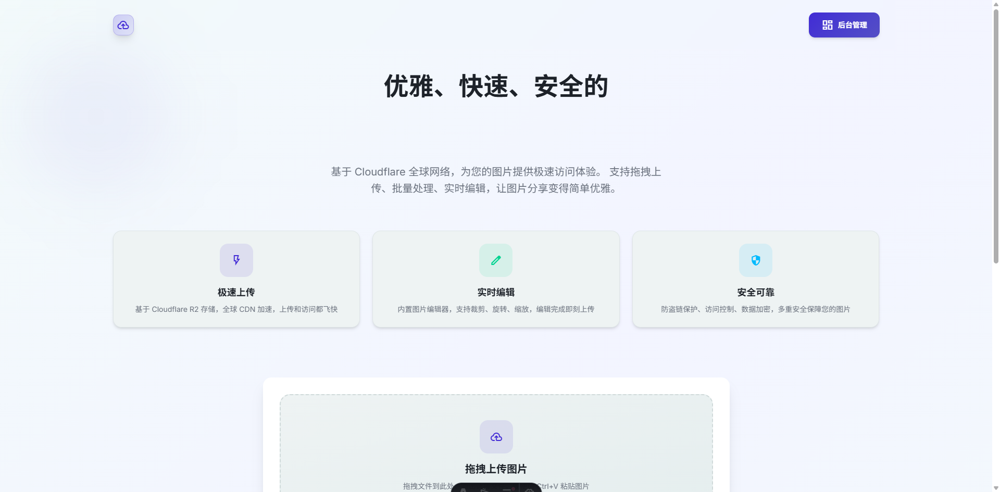
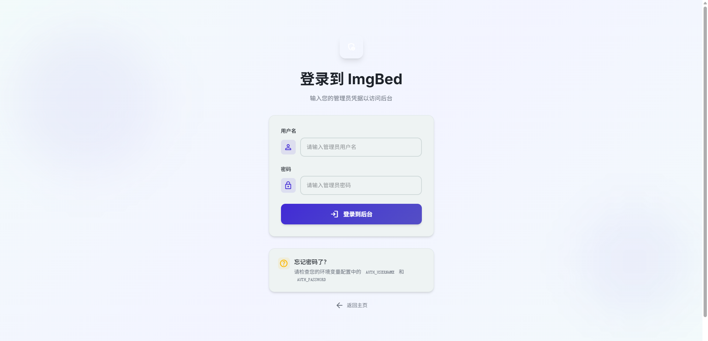
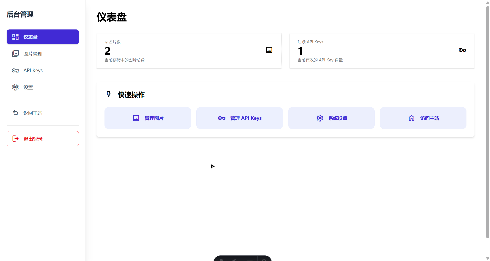
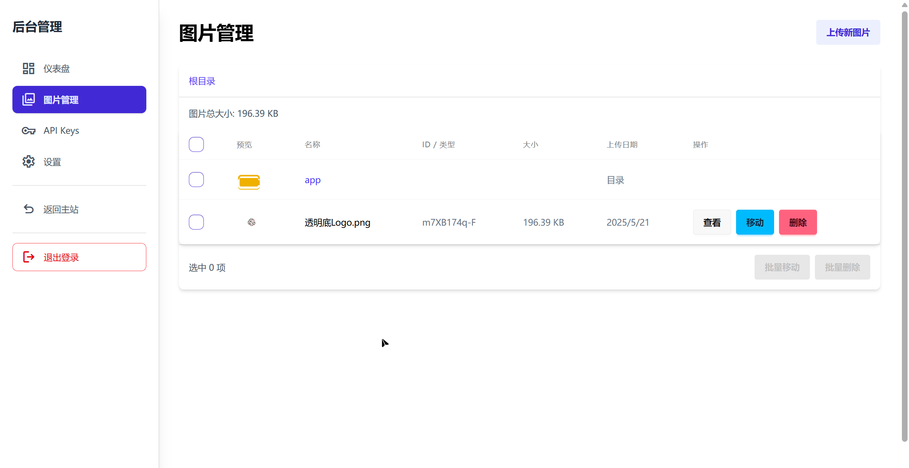

# CF-ImgBed: Cloudflare 图床应用

一个基于 Astro 和 Cloudflare 构建的现代化、简约风格的个人图床网站。使用 Cloudflare R2 进行图片存储，Cloudflare KV 存储元数据，并通过 Cloudflare Pages/Workers 提供服务。

## ✨ 功能特性

-   **图片上传**:
    -   支持拖拽上传、点击选择文件、粘贴图片上传。
    -   支持批量上传。
    -   可指定上传目录。
    -   上传后显示多种格式的访问链接 (URL, Markdown, HTML)，支持点击复制，并提供复制成功反馈。
    -   可在后台设置默认复制格式 (保存于浏览器 localStorage)，上传完成后自动复制该格式链接。
-   **认证与授权**:
    -   用户登录认证后方可上传和管理。
    -   支持 API Key 认证上传。
-   **后台管理界面**:
    *   **仪表盘**: 显示图片总数、活跃 API Key 数量。
    *   **图片管理**:
        *   目录式浏览，支持面包屑导航。
        *   显示当前目录下图片的总大小。
        *   支持图片的列出、预览、删除、批量删除、移动到其他目录。
    *   **API Key 管理**: 生成、列出、撤销 API Key。
    *   **设置**: 配置默认复制格式、图片访问前缀、自定义网站域名、防盗链及白名单域名。
-   **图片访问**:
    *   支持自定义图片访问URL前缀。
    *   每张图片拥有基于短 ID 的访问链接。
    *   支持基本防盗链功能。
-   **样式**:
    *   黑白简约配色，层次分明。
    *   使用 Tailwind CSS v4。

## 🛠️ 技术栈

-   **框架**: [Astro](https://astro.build/)
-   **运行环境**: [Cloudflare Pages](https://pages.cloudflare.com/) / [Cloudflare Workers](https://workers.cloudflare.com/)
-   **图片存储**: [Cloudflare R2](https://developers.cloudflare.com/r2/)
-   **元数据存储**: [Cloudflare KV](https://developers.cloudflare.com/kv/)
-   **样式**: [Tailwind CSS v4](https://tailwindcss.com/)
-   **依赖管理**: [pnpm](https://pnpm.io/)

## 预览









## 🚀 部署与配置

### 1. 克隆项目

```bash
git clone https://github.com/twiify/CF-ImgBed
cd CF-ImgBed
```

### 2. 安装依赖

```bash
pnpm install
```

### 3. Cloudflare 配置

您需要在 Cloudflare Dashboard 中创建以下资源：

-   **R2 存储桶**: 用于存储图片文件。
    -   记下存储桶的名称 (Bucket Name)。
-   **KV 命名空间**: 用于存储图片元数据、API Key、设置等。
    -   记下命名空间的 ID。

### 4. Wrangler 配置文件 (`wrangler.jsonc`)

编辑项目根目录下的 `wrangler.jsonc` 文件，填入您在上一步中创建的资源信息：

```jsonc
{
  // ... 其他配置 ...
  "vars": {
    "AUTH_USERNAME": "your_admin_username", // 替换为您的后台登录用户名
    "AUTH_PASSWORD": "your_admin_password"  // 替换为您的后台登录密码 (生产环境强烈建议使用 Secrets)
  },
  "kv_namespaces": [
    {
      "binding": "IMGBED_KV",         // 代码中使用的绑定名称 (请勿修改)
      "id": "your_kv_namespace_id"  // 替换为您的 KV Namespace ID
      // "preview_id": "your_kv_namespace_preview_id" // 可选，用于本地预览的 KV ID
    }
  ],
  "r2_buckets": [
    {
      "binding": "IMGBED_R2",             // 代码中使用的绑定名称 (请勿修改)
      "bucket_name": "your_r2_bucket_name" // 替换为您的 R2 存储桶名称
      // "preview_bucket_name": "your_r2_preview_bucket_name" // 可选
    }
  ]
}
```

**重要**: 对于生产环境，`AUTH_USERNAME` 和 `AUTH_PASSWORD` 应通过 Cloudflare Dashboard 中的 Secrets 进行配置，而不是直接写入 `wrangler.jsonc` 的 `vars` 中。
   - 在 Cloudflare Pages 项目设置中 -> Environment Variables -> Add secret。
   - 添加 `AUTH_USERNAME` 和 `AUTH_PASSWORD`。

### 5. 本地开发 (可选)

```bash
pnpm run dev
```
这将启动 Astro 开发服务器，通常结合 Miniflare 进行本地 Cloudflare 环境模拟。您可能需要：
-   创建一个 `.dev.vars` 文件在项目根目录，并填入：
    ```
    AUTH_USERNAME="your_local_username"
    AUTH_PASSWORD="your_local_password"
    ```
-   对于 KV 和 R2 的本地模拟，Wrangler 会尝试在 `.wrangler/state/v3/` 目录下创建本地存储。确保 Wrangler (`wrangler login`) 已正确配置并登录。

### 6. 部署到 Cloudflare Pages

-   将您的代码推送到 GitHub/GitLab 仓库。
-   在 Cloudflare Dashboard 中，进入 Pages -> Create a project -> Connect to Git。
-   选择您的仓库和分支。
-   **构建设置**:
    -   **Framework preset**: Astro
    -   **Build command**: `pnpm build` (对应 `package.json` 中的 `astro build`)
    -   **Build output directory**: `dist` (Astro 默认输出目录)
-   **环境变量与绑定**:
    -   在 Pages 项目的 Settings -> Environment Variables 中，确保已配置生产用的 `AUTH_USERNAME` 和 `AUTH_PASSWORD` (作为 Secrets)。
    -   在 Settings -> Functions -> KV namespace bindings 中，添加绑定：
        -   Variable name: `IMGBED_KV`
        -   KV namespace: 选择您创建的 KV 命名空间。
    -   在 Settings -> Functions -> R2 bucket bindings 中，添加绑定：
        -   Variable name: `IMGBED_R2`
        -   R2 bucket: 选择您创建的 R2 存储桶。
-   点击 "Save and Deploy"。

### 7. 配置网站设置

部署完成后，访问您的网站后台 (`/admin/settings`) 进行以下配置：
-   **自定义网站域名**: (例如 `https://img.yourdomain.com`) 用于生成图片的公开链接。如果留空，系统会尝试使用当前请求的域名。
-   **自定义图片访问前缀**: (例如 `i`, `files`) 图片链接会是 `yourdomain.com/<prefix>/imageId.ext`。默认为 `img`。
-   **防盗链设置**: 启用并配置允许的域名。

## 🔌 API 上传

图片可以通过 API Key 进行上传。

### 1. 生成 API Key

-   登录后台管理界面。
-   导航到 "API Keys" 页面。
-   点击 "生成新的 API Key"，输入一个名称（可选），然后生成。
-   **立即复制并妥善保管生成的完整 API Key**。关闭弹窗后将无法再次查看。

### 2. 上传请求

向 `/api/upload` 端点发送 `POST` 请求。

-   **Method**: `POST`
-   **Headers**:
    -   `X-API-Key`: `your_full_api_key` (替换为您生成的完整 API Key)
    -   `Content-Type`: `multipart/form-data` (当发送文件时)
-   **Body** (form-data):
    -   `files`: 图片文件。可以发送多个 `files` 字段以实现批量上传。
    -   `uploadDirectory` (可选): 字符串，指定上传目录，例如 `wallpapers/nature`。

#### 示例 (cURL)

```bash
curl -X POST \
  -H "X-API-Key: imgbed_sk_xxxxxxxxxxxx_yyyyyyyyyyyyyyyyyyyyyyyyyyyyyyyy" \
  -F "files=@/path/to/your/image1.jpg" \
  -F "files=@/path/to/your/image2.png" \
  -F "uploadDirectory=my_uploads/summer" \
  https://your-imgbed-domain.com/api/upload
```

#### 成功响应示例 (JSON)

```json
{
  "message": "Files uploaded successfully!",
  "files": [
    {
      "id": "shortId1",
      "r2Key": "my_uploads/summer/shortId1.jpg",
      "fileName": "image1.jpg",
      "contentType": "image/jpeg",
      "size": 102400, // bytes
      "uploadedAt": "2023-10-27T10:00:00.000Z",
      "userId": "api_key_user_id_if_available", // User ID associated with the API key
      "uploadPath": "my_uploads/summer",
      "url": "https://your-imgbed-domain.com/img/shortId1.jpg" // Public URL
    },
    // ... more files if batch uploaded
  ]
}
```

#### 错误响应示例 (JSON)

```json
{
  "error": "Unauthorized" // 或其他错误信息
}
```
状态码：`401` (未授权), `400` (错误请求), `500` (服务器错误) 等。

## 🤝 贡献

欢迎提交 Pull Requests 或 Issues。

## 📄 许可证

本项目采用 MIT 许可证。
